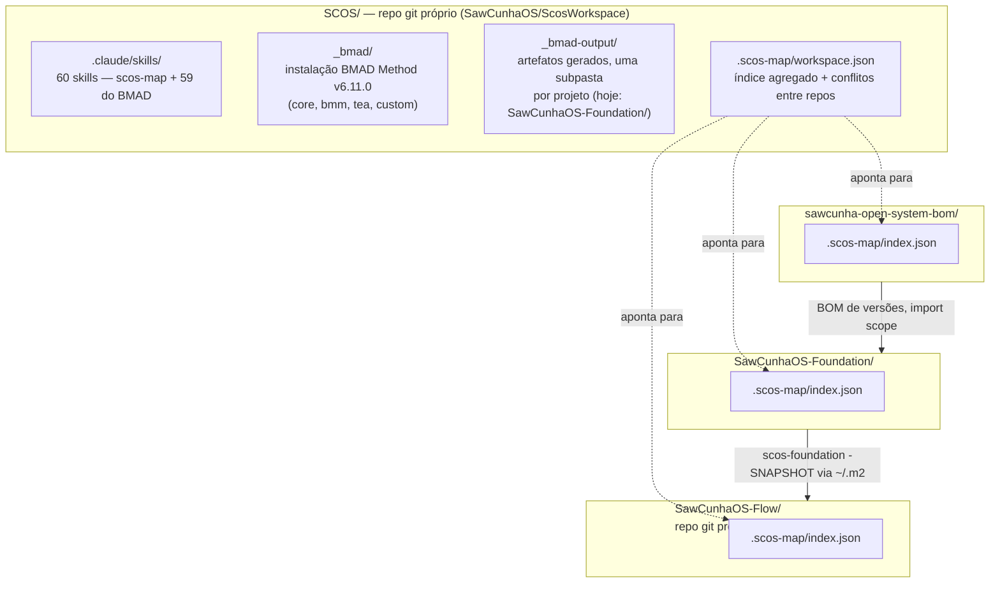
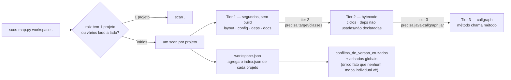

# SCOS Workspace


Workspace que agrupa os repositórios Git independentes do ecossistema **SCOS**
(SawCunha Open System) lado a lado, e hospeda a instalação compartilhada das
ferramentas de IA (skills do Claude Code, BMAD Method) usadas para trabalhar
neles. Este próprio diretório é um repositório Git (`SawCunhaOS/ScosWorkspace`),
mas os três repositórios de produto abaixo dele **não são submódulos** — são
clones comuns, cada um com seu próprio remote, branch e histórico, ignorados
por este repo.

## Visão geral

O ecossistema SCOS é dividido em três repositórios com uma cadeia de
dependência estrita — `bom → Foundation → Flow` — e este workspace existe por
dois motivos:

1. **Ponto de trabalho único** para quem desenvolve nos três ao mesmo tempo,
   sem precisar navegar entre clones separados.
2. **Instalação central de ferramental de IA** — skills do Claude Code e o
   framework [BMAD Method](https://github.com/bmad-code-org) ficam instalados
   aqui uma vez (`.claude/`, `_bmad/`) e são usados através dos três repos, em
   vez de duplicados em cada um.

Não há build agregador aqui: não existe `pom.xml` na raiz. Cada comando Maven
roda de dentro do repo relevante (`cd SawCunhaOS-Foundation && mvn ...`).

## Estrutura



| Diretório | É rastreado por este repo? | Conteúdo |
|---|---|---|
| `.claude/skills/` | sim | Skills do Claude Code: `scos-map` + 59 skills do BMAD Method |
| `_bmad/` | sim | Instalação do BMAD Method v6.11.0 (módulos `core`, `bmm`, `tea`, `custom`) |
| `_bmad-output/` | sim | Artefatos gerados pelo BMAD, uma subpasta por projeto (`<projeto>/planning-artifacts/`, `specs/`, `implementation-artifacts/`, `test-artifacts/`) — hoje só `SawCunhaOS-Foundation/`. Os repos de produto não guardam artefatos BMAD |
| `.scos-map/` | sim | Índice estrutural agregado do workspace — ver seção dedicada abaixo |
| `sawcunha-open-system-bom/` | **não** (repo próprio) | BOM de versões |
| `SawCunhaOS-Foundation/` | **não** (repo próprio) | Biblioteca fundacional Java |
| `SawCunhaOS-Flow/` | **não** (repo próprio) | Produto — motor de identidade/organização de um ISP |

## Os trabalhos

| Repositório | GitHub | O que é |
|---|---|---|
| `sawcunha-open-system-bom/` | `SawCunhaOS/sawcunha-open-system-bom` | BOM (`packaging=pom`, sem código) — alinha versões de dependência e convenções de build para todo o ecossistema |
| `SawCunhaOS-Foundation/` | `SawCunhaOS/SawCunhaOS-Foundation` | Biblioteca fundacional Java: auditoria, privacidade/masking LGPD, tratamento de exceção RFC 9457, idempotência, cache, utils |
| `SawCunhaOS-Flow/` | `SawCunhaOS/SawCunhaOS-Flow` (artifactId `flow`) | O produto: motor de identidade/organização/governança de acesso de um ISP. Módulo ativo: `organization` |

Detalhe de arquitetura, convenções e estado de sprint de cada um está no
`README.md` do próprio repo — não duplicado aqui (ver `CLAUDE.md` deste
workspace).

## Ferramentas de IA instaladas aqui

- **Claude Code skills** (`.claude/skills/`) — 60 skills, das quais 59 são o
  conjunto padrão do BMAD Method (agentes de PM/arquiteto/dev/analista,
  workflows de PRD/arquitetura/stories/review/retro/teste) e uma é
  `scos-map`, específica deste workspace (ver abaixo).
- **BMAD Method** (`_bmad/`) — v6.11.0, instalado com os módulos `core`,
  `bmm` (BMad Method), `tea` (Test Architect Enterprise) e `custom`. Config em
  `_bmad/config.toml` / `_bmad/config.user.toml`; manifesto de instalação em
  `_bmad/_config/manifest.yaml`.
- **Saída do BMAD** (`_bmad-output/<projeto>/`) — histórico real de specs,
  planejamento e artefatos de implementação/teste já produzidos trabalhando
  nos repos acima, uma subpasta por projeto (ex.:
  `SawCunhaOS-Foundation/implementation-artifacts/epic-2-retro-2026-08-29.md`,
  dezenas de `<epic>-<story>-<slug>.md` de implementação). Só o workspace
  guarda artefatos BMAD; os antigos do Flow estão no histórico git dele
  (`git -C SawCunhaOS-Flow show e56929b^:_bmad-output/<arquivo>`).

## Foco: a skill `scos-map`

`scos-map` (`.claude/skills/scos-map/`) é o ponto focal deste workspace: um
**índice estrutural de repositório**, não um grafo de código nem substituto
da leitura do código-fonte. Ele responde "onde mora o quê, com que
configuração, com quais dependências e versões, e como os módulos se
relacionam" sem que um agente de IA precise ler o repositório inteiro para
descobrir isso — e é o único mecanismo deste workspace capaz de comparar
versões de biblioteca **entre** os três repositórios ao mesmo tempo.

### Por que existe

Perguntas sobre organização de código ("onde fica a config de X", "quem usa
essa dependência", "existe ciclo entre esses pacotes") custam caro em tokens
se resolvidas lendo código-fonte bruto. `scos-map` pré-computa esses fatos
uma vez, em arquivos JSON pequenos e versionados por módulo, e um agente só
abre o fato específico que a pergunta exige.

### Como funciona — pipeline em tiers



- **Tier 1** (padrão, `scan .`) — layout, config, dependências declaradas e
  docs. Roda sempre, em segundos, sem compilar nada. Cobre a maioria das
  perguntas de navegação.
- **Tier 2** (`--tier 2`) — exige `target/classes` compilado; o script
  **nunca compila sozinho**. Lê bytecode para achar ciclos entre pacotes,
  dependência usada mas não declarada no `pom.xml`, e dependência declarada
  mas não usada.
- **Tier 3** (`--tier 3 --callgraph-jar <path>`) — grafo método-a-método via
  `java-callgraph`. Só sob pedido explícito.

Cada fato carrega seu próprio nível de confiança (`alta`, `resolvida`,
`declarada`, `media`, `heurística`) e estado de frescor (`fresco` /
`obsoleto` — obsoleto significa que o fonte mudou depois do fato ser gerado).

### Saída no disco

```
<projeto>/.scos-map/
├── index.json              # único arquivo que precisa ser lido sempre
├── files.tsv                # tabela de arquivos (path, módulo, tipo, churn 90d...) — consultar com grep/awk, não carregar inteiro
└── facts/
    ├── _reactor.json         # módulos do reator, fronteiras, conflitos de versão internos
    └── <módulo>/
        ├── layout.json
        ├── config.json
        ├── deps.json
        ├── docs.json
        ├── bytecode.json     # tier 2
        └── callgraph.json    # tier 3

SCOS/.scos-map/
└── workspace.json           # agrega o index.json de cada projeto + conflitos_de_versao_cruzados + achados globais
```

Em modo workspace, o roteiro é sempre: ler `workspace.json` primeiro, escolher
o projeto relevante em `projetos[]`, abrir só o `index.json` dele, e dentro
dele abrir só os fatos que a pergunta exige — nunca todos de uma vez.

### Resultado atual deste workspace

Última geração: `2026-09-09T22:10:41Z` (`scos-map workspace .`, tier 3
solicitado). Regenere com `scos-map.py workspace . --only <projeto>` sempre
que um projeto mudar significativamente — um fato "obsoleto" ainda responde,
mas avisa que as fontes mudaram desde que foi gerado.

| Projeto | Arquivos | Fontes → Mapa | Redução | Tempo |
|---|---:|---|---:|---:|
| `SawCunhaOS-Flow` | 949 | 4,4 MB → 1,2 MB | 3,6× | 62,9 s |
| `SawCunhaOS-Foundation` | 441 | 1,7 MB → 397 KB | 4,4× | 35,3 s |
| `sawcunha-open-system-bom` | 24 | 93 KB → 13 KB | 7,1× | 1,8 s |
| **Total** | **1414** | — | — | — |

**Conflitos de versão cruzados** (só visíveis comparando os três repos ao
mesmo tempo — nenhum `index.json` individual enxerga isso sozinho):

| Biblioteca | Em `SawCunhaOS-Flow` | Em `SawCunhaOS-Foundation` |
|---|---|---|
| `io.github.openfeign.querydsl:querydsl-apt` | gerenciada pelo BOM `jpa` | `7.6` (módulo `validation`) |
| `org.apache.httpcomponents:httpclient` | `4.5.3` | `4.5.13` (módulo `jdempotent`) |
| `org.jetbrains:annotations` | `13.0` | `17.0.0` (módulos `audit`, `jdempotent`) |

**Outros achados** (tier 3 solicitado, mas indisponível em todos os módulos
por falta de `java-callgraph.jar` no ambiente — resultado até tier 2):

- 1 ciclo de pacotes: `SawCunhaOS-Foundation/jdempotent` entre
  `redis.configuration` e `redis.repository`.
- 18 dependências declaradas e não usadas (predominantemente em
  `SawCunhaOS-Flow/infrastructure` e `SawCunhaOS-Foundation/jdempotent`).
- 0 dependências usadas e não declaradas.
- 23 pontos de entrada, 34 lacunas de análise mapeadas.

### Comandos essenciais

```bash
python3 .claude/skills/scos-map/scos-map.py status .          # já existe mapa? o que está obsoleto?
python3 .claude/skills/scos-map/scos-map.py workspace .       # (re)gera o mapa dos 3 projetos + conflitos cruzados
python3 .claude/skills/scos-map/scos-map.py workspace . --only SawCunhaOS-Foundation   # reprocessa só um projeto
python3 .claude/skills/scos-map/scos-map.py workspace . --all # tier 3 completo, compila e usa Maven online
```

Regras de uso, ao consultar o mapa via a skill: nunca ler todos os fatos "para
ter o quadro completo"; respeitar o nível de confiança de cada fato;
`metodos_sem_chamador` do callgraph **não** é lista de código morto
(endpoints HTTP, `@Scheduled` e `@EventListener` nunca têm chamador estático);
doc antiga ao lado de código recente é sinal de defasagem, não de verdade.
