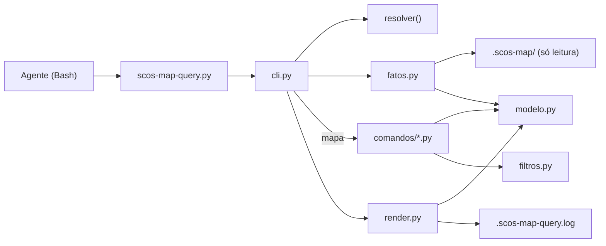
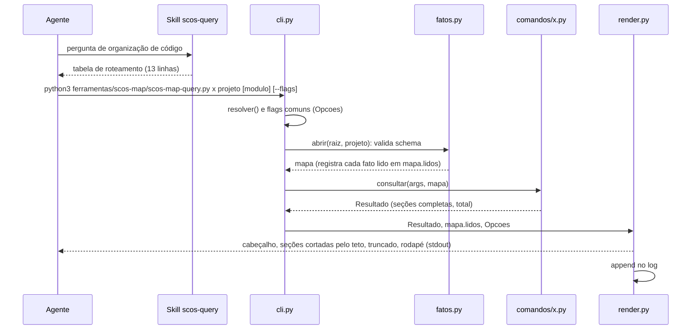
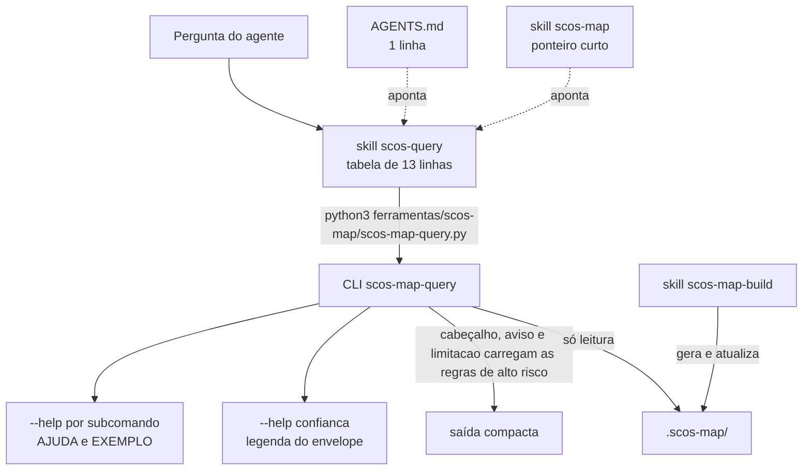

# Architecture Spine — scos-map-query

## Design Paradigm

**Pipeline com renderizador único.** Dado entra por leitores, vira `Resultado` numa função pura e sai por um único ponto de impressão. A saída é escrita para LLM ler: regular, sem prosa, sem decoração.

| Camada | Módulo | Faz | Não faz |
| --- | --- | --- | --- |
| Entrada | `cli.py` | `argparse` (flags comuns), `resolver()`, `fatos.abrir`, `main()`, captura de `ErroConsulta` | lógica de fato |
| Leitura | `fatos.py` | abre arquivo, valida schema, lê JSON/TSV, calcula `estado` final e `commits_desde`, devolve registros e `Meta` | formatar saída |
| Consulta | `comandos/<x>.py` | filtra e agrupa os registros recebidos de `mapa` em seções | E/S, flags comuns, truncamento |
| Saída | `render.py` | envelope, pior caso, teto, `tsv_clean`, impressão, log | interpretar fato |
| Contrato | `modelo.py` | `Resultado`, `Secao`, `Meta`, `Opcoes`, `ErroConsulta` | lógica |
| Apoio | `filtros.py` | filtros comuns entre subcomandos (ex.: `--ga`) | E/S |



Dependência: `cli → {fatos, comandos, render, modelo}`; `comandos → {modelo, filtros}`; `fatos → modelo`; `render → modelo`. Nenhuma seta volta. `comandos` não importa `fatos` nem `render`: lê fatos só pelo objeto `mapa` que recebe.

## Invariants & Rules

### AD-1 — Contrato do subcomando: função pura sobre `mapa` [ADOPTED]

- **Binds:** todos os subcomandos; FR-1, FR-2, FR-5, FR-6, FR-8, FR-9.
- **Prevents:** envelope, teto e log diferentes entre subcomandos escritos em stories diferentes; subcomando que lê fato por fora do registro de fontes.
- **Rule:** cada `comandos/<x>.py` expõe exatamente: `NOME`, `PERGUNTA` (uma linha), `ESCOPO` ∈ {`workspace`, `projeto`, `modulo`}, `FLAGS` (só as específicas), `AJUDA` (≤ 1.500 bytes), `EXEMPLO` (TSV literal de 3 a 5 linhas, caso de aceitação) e `consultar(args, mapa) -> Resultado`. `mapa` é criado por `cli.py` (`fatos.abrir`), entrega registros e **registra cada fato aberto** em `mapa.lidos` (lista ordenada de `Meta`). Todo fato lido passa por `mapa`. O módulo nunca abre arquivo, imprime, lê ambiente nem aplica `--limit`, `--bytes`, `--all` ou `--base`. Escopos: `workspace` = `conflitos`, `snapshots`; `projeto` = `reactor`, `arquivos`; `modulo` = `layout`, `config`, `deps`, `gerenciadas`, `docs`, `arestas`, `tests`, `bytecode`, `callgraph`. Teste: lista **branca** de imports em `comandos/` (`modelo`, `filtros`, `re`, `typing`, `dataclasses`, `collections`) e proibição dos nomes `open`, `print`, `input`; arquivos `comandos/_*.py` não entram no registro; nenhum arquivo do pacote casa com `test*.py`.

### AD-2 — Tipos do contrato e formato de saída LLM-first [ADOPTED]

- **Binds:** `modelo.py`, todos os subcomandos, `render.py`; FR-5, FR-6, FR-9, FR-12.
- **Prevents:** campos improvisados por story; golden que difere por TAB ou espaço; resumo contado como linha que casa; marca de risco cortada pelo truncamento.
- **Rule:**
  - `Secao(nome, colunas, linhas, total, tipo, fonte)`. `linhas` é sempre o conjunto **completo** que casa com os filtros do subcomando e `total = len(linhas)`; `tipo` ∈ {`dados`, `resumo`}; `fonte` = `Meta.arquivo` de onde vieram as linhas. Células são `str`; ausente = `-`. O comando declara as seções do §4.0 em ordem de importância, **mesmo vazias** (`0 de 0`).
  - `Resultado(secoes, avisos, limitacoes, refinar)`. `avisos` ≤ 100 bytes cada; `refinar` é a lista ordenada de flags sugeridas (nunca `--all` primeiro).
  - Marca (`[heuristica]`, `[transitiva]`, `[provavel_falso_positivo]`, `[<confianca>]`) é a coluna `marca`, última da seção, escrita pelo comando. A marca de confiança só aparece quando a `confianca` da linha difere da `Meta.confianca` do fato `fonte` da linha (não do pior caso do cabeçalho); `[heuristica]` de `tests` sai sempre.
  - `Meta(fato, arquivo, confianca, estado, completude, base, desvios, heads, commits_desde, limitacoes, motivo, schema_versao, gerado, avisos)`: `arquivo` é o caminho relativo à raiz do workspace, com `/`; campo que o fato real não tem fica `None` (render escreve `-`). Medido nos mapas reais: `completude` só em `deps`, `docs`, `tests`; `frescor` só em `bytecode`; `desvios` quase nunca; `confianca` falta em `callgraph`.
  - Formato literal (`\t` = TAB): `## <nome> (<mostradas> de <total>)` seguido de `\t<coluna>` por coluna; seção sem colunas usa só `## <nome> (<m> de <t>)`. Subcomando de seção única usa o mesmo formato. Seção `resumo` sai inteira (até 20 linhas), fora do teto e de `n`/`M`. Sem prosa, alinhamento, cor ou decoração.

### AD-3 — Só `fatos.py` conhece o formato dos fatos [ADOPTED]

- **Binds:** `fatos.py`; FR-1, FR-5, NFR-1.
- **Prevents:** dois subcomandos lendo o mesmo TSV de jeitos diferentes; quebra por coluna reordenada; frescor calculado em dois lugares.
- **Rule:** registros com acesso **por nome** (TSV pela linha de cabeçalho, nunca por posição); `derivado_de` por arquivo é descartado (guarda só `heads`; em `workspace.json` ele é `repo → {head, deps_sha}`); chave ausente = `None`. `estado` final segue a precedência de FR-5 (disponibilidade, depois `frescor` do fato, depois frescor barato por `.git/HEAD` sem subprocesso, que inclui `desconhecido`) e é calculado aqui, nunca no render. `commits_desde` é calculado aqui. O leitor usa `split('\t')`. Chaves e arquivos: `arestas` → `bytecode_edges.tsv`, `arquivos` → `files.tsv` (raiz do mapa), `deps` une `deps.tsv` do módulo com `facts/_transitivas_comuns.tsv` do projeto (lido **uma vez**, em seção própria `transitivas`, também com `--todos-modulos`).

### AD-4 — Envelope: pior caso entre fatos, ordem fixa [ADOPTED]

- **Binds:** `render.py`; FR-5.
- **Prevents:** subcomando de vários fatos que mostra só o estado do primeiro; duas leituras da mesma ordem.
- **Rule:** o render combina `mapa.lidos` pelo pior caso. `confianca` (pior → melhor): `conflito`, `heuristica`, `parcial`, `media`, `declarada`, `resolvida`, `alta`. `estado` (pior → melhor): `obsoleto`, `desconhecido`, `ausente`, `indisponivel`, `nao_aplicavel`, `disponivel`, `fresco`. `completude`: `parcial` pior que `completa`; ausente é ignorada. A ordem vale **entre** fatos; dentro de um fato vale a precedência de AD-3. `# fontes: <arquivo>(<confianca>,<estado>) ...` agrupa por fato (`deps.tsv×8`); o envelope inteiro tem no máximo 12 linhas e 1.500 bytes, o excedente vira `… +N fontes`. `commits_desde_o_mapa`: um repositório → `N`; vários → `<repo>:<N>,...` na ordem de `Meta.heads`. Última linha de toda saída: `# <n> de <M> linhas casam | fontes: <arquivos>`, com `n` e `M` somando só seções `dados`; só `resumo` → `# resumo | fontes: ...`.

### AD-5 — Raiz única, escopo único, erro único, canal único [ADOPTED]

- **Binds:** `cli.py`, `render.py`; FR-1, FR-8.
- **Prevents:** caminhos montados por subcomando; `argparse` escrevendo em stderr; nome de módulo interpretado de formas diferentes.
- **Rule:** `resolver(projeto, modulo)` devolve um `Caminhos` e é a única função que conhece a árvore do mapa. Raiz = ancestral mais próximo do diretório corrente com `.scos-map/workspace.json`; sem ele o CLI falha (3). Projeto só existe se listado em `workspace.json`. Módulo = caminho relativo sob `facts/` exatamente como em `index.json` (`organization/flow-organization-usecase`, `_raiz`); o `resolver` também aceita o basename quando é único (ambíguo: erro 2 listando as opções). Escopo `modulo` sem módulo: 2; módulo em escopo `projeto`/`workspace`: 2; projeto ou módulo inexistente: 3. `cli.py` usa `ArgumentParser` subclassado cujo `error()` levanta `ErroConsulta(2)`; o `--help` imprime `AJUDA` literal (não o texto do `argparse`, que varia entre versões do Python). Erro sai em **stdout**: `# erro: <mensagem> | acao: <comando>`. Códigos: 0 ok, 1 interno (`# erro: interno`, sem traceback; `SCOS_MAP_QUERY_DEBUG=1` mostra), 2 uso inválido, 3 ausente, 4 `schema_versao` major incompatível. Só `cli.py` e `render.py` leem `os.environ`.

### AD-6 — Saída segura e estável [ADOPTED]

- **Binds:** `render.py`; FR-9.
- **Prevents:** coluna deslocada; goldens instáveis; marca cortada; saída enorme sem aviso.
- **Rule:** `tsv_clean(v)` = `re.sub(r"[\t\r\n]+", " ", str(v))`, idêntico ao do gerador (uma **sequência** vira um espaço); aplicado a toda célula. Truncamento de linha: 240 caracteres Unicode depois do `tsv_clean`, com `…`, nunca na coluna `marca`; `--all` não o desliga. Ordem: seções na ordem do comando; linhas na ordem do arquivo; módulos na ordem de `index.json`; agrupamentos por primeira aparição. Teto padrão de 50 linhas e 6.000 bytes de dados, **global**, consumido na ordem das seções `dados`; título de seção, cabeçalho, limitação e rodapé não contam; seção cortada continua visível com a contagem. Quando houver corte, uma linha `# truncado: use <flag de Resultado.refinar>` antes do rodapé.

### AD-7 — Schema testado é uma constante; mudança dispara revisão [ADOPTED]

- **Binds:** `fatos.py`, testes; FR-1.
- **Prevents:** evolução do gerador que o CLI continua aceitando com formato errado; `2.10 < 2.9` por comparação de string.
- **Rule:** `SCHEMA_TESTADO = (2, 1)` num só lugar. `fatos.abrir` compara tuplas de inteiros: major igual e minor ≤ testado: aceita; minor maior: segue e põe `# aviso: schema <v> mais novo que o testado (2.1)` em `Meta.avisos`; major diferente: `ErroConsulta(4)`. Qualquer evolução do schema obriga a revisar leitores, goldens e `--help`.

### AD-8 — `PERGUNTA` é a única fonte do roteamento [ADOPTED]

- **Binds:** `comandos/`, skill `scos-query`, `AGENTS.md`; FR-7, FR-11.
- **Prevents:** três tabelas de roteamento (skill, `AGENTS.md`, `--help`) que derivam para versões diferentes.
- **Rule:** `PERGUNTA` de cada módulo alimenta o `--help` geral. A tabela de 13 linhas vive **só** na skill `scos-query`; o `AGENTS.md` tem uma linha apontando para ela. Teste: a tabela da skill tem exatamente os `NOME` e as `PERGUNTA` do registro. O registro é a lista dos módulos de `comandos/` (menos `_*.py`), sem dispatch escrito à mão.

### AD-9 — Somente leitura, uma exceção de escrita [ADOPTED]

- **Binds:** todo o pacote; FR-1, FR-8, NFR-1.
- **Prevents:** o CLI alterando o mapa ou disparando geração; log em formato livre.
- **Rule:** nunca escreve em `.scos-map/`, nunca compila, nunca chama o gerador. A única escrita é o log (`.scos-map-query.log` na raiz do workspace, ou `SCOS_MAP_QUERY_LOG`), feita por `render.emitir(...)`, que escreve stdout e log juntos; `main` chama `emitir` em todos os caminhos, inclusive erro 1 e 2. Registro TSV: `ts_utc \t subcomando \t projeto \t modulo \t bytes_stdout_utf8 \t linhas_stdout \t codigo \t schema_versao` (`-` para o desconhecido), um único `write` em modo append; falha ao gravar nunca impede a resposta. A única chamada de `git` é `rev-list --count <head>..HEAD` por repositório, somente leitura, feita por `fatos.py`.

### AD-10 — Subcomandos de workspace não recebem projeto [ADOPTED]

- **Binds:** `conflitos`, `snapshots`; FR-3, FR-4.
- **Prevents:** convenção "projeto obrigatório" aplicada a fatos que não pertencem a projeto.
- **Rule:** `conflitos` e `snapshots` (`ESCOPO = workspace`) leem só `workspace.json` e **não** recebem projeto. Nos demais: projeto posicional obrigatório, módulo posicional só em escopo `modulo`, filtro sempre flag nomeada com o mesmo nome em todos os subcomandos. `--todos-modulos` existe só em `deps` e substitui o módulo.

### AD-11 — Divisão de cálculo e flags comuns [ADOPTED]

- **Binds:** `cli.py`, `comandos/`, `render.py`; FR-2, FR-9.
- **Prevents:** total perdido (`50 de 50`) quando o comando já cortou; `--limit` com semântica diferente por subcomando.
- **Rule:** o comando filtra, agrupa, preenche `total`, `marca` e `refinar`. O render calcula `mostradas`, corta, conta `n`/`M` e monta `# truncado:`. As flags comuns (`--limit`, `--bytes`, `--all`, `--base`) pertencem a `cli.py`, que as registra em todo subparser e entrega ao render como `Opcoes`; o comando não as declara nem as vê. `--all` junto com `--limit` ou `--bytes`: erro 2.

### AD-12 — Estados de leitura e erro com envelope [ADOPTED]

- **Binds:** `fatos.py`, `cli.py`, `render.py`; FR-1, FR-5, FR-10, FR-14.
- **Prevents:** o mesmo "fato não utilizável" tratado como erro num subcomando e como resultado em outro; união parcial de fatos (a armadilha de UJ-5).
- **Rule:** arquivo de fato `ausente` → `ErroConsulta(3)`; `indisponivel` e `nao_aplicavel` → `Resultado` normal, código 0, com `motivo` no envelope. Subcomando que une vários fatos e perde qualquer um: erro 3 citando qual, nunca união parcial. `main` anexa `mapa.lidos` à exceção; o render imprime o cabeçalho (se houver fato lido), a linha `# erro:` e, quando houve fato lido, o rodapé como última linha.



## Consistency Conventions

| Concern | Convention |
| --- | --- |
| Naming | subcomando = `NOME` em português minúsculo; módulo livre fora de `test*.py` e de `_*.py` reservado a apoio; flags `--kebab-case` em português, mesmo nome entre subcomandos; módulo posicional = caminho de `index.json` |
| Data & formats | saída TSV com seções; células `str`, ausente `-`, limpas por `tsv_clean`; timestamps do mapa (UTC `Z`); ordem estável do fato |
| Testes | suíte `ferramentas/scos-map/tests/` com `fixtures.py`: golden por subcomando e flag (mapa sintético com `gerado_em` e git fixos; `--help` golden é o `AJUDA`, nunca o texto do `argparse`); tabela da skill = `NOME`/`PERGUNTA`; lista branca de imports; `SCHEMA_TESTADO`; mínimo 3.10: `ast.parse(feature_version=(3, 10))` em todo o pacote e teste que proíbe API que exija mais que 3.10 (`tomllib`, `datetime.UTC`, `enum.StrEnum`, `typing.Self`, `ExceptionGroup`, `except*`); a suíte também roda num interpretador 3.10 quando houver um; teste de `git rev-list` com hash abreviado de 12 caracteres; latência ≤ 300 ms (NFR-2) medida sobre o maior fixture; benchmark SM-1 contra o mapa real, pulado se ele não existir |
| Fixtures novos | só os que o PRD exige: callgraph disponível, estado misto (Q8) e `resolvida`+`parcial` (SM-C1) |
| State & cross-cutting | sem estado além do log; sem rede; `git` só em `fatos.py`; erro sempre via `ErroConsulta` |

## Stack

| Name | Version |
| --- | --- |
| Python (só stdlib) | ≥ 3.10 (3.10 é o mínimo; roda em versões mais novas; a máquina local tem 3.14.4, sem 3.10 instalado) |
| `schema_versao` do `.scos-map` | 2.1 (`SCHEMA_TESTADO = (2, 1)`) |

## Structural Seed

```text
ferramentas/scos-map/
  scos-map.py                 # gerador (não é tocado)
  scos-map-query.py           # entry fino: chama scos_map_query.cli.main()
  scos_map_query/
    modelo.py                 # Resultado, Secao, Meta, Opcoes, ErroConsulta
    fatos.py                  # abrir(), leitores, frescor, commits_desde
    render.py                 # envelope, teto, tsv_clean, emitir(), log
    cli.py                    # argparse, resolver(), main()
    filtros.py                # filtros comuns (--ga etc.)
    comandos/                 # 13 módulos: layout config deps gerenciadas docs reactor
                              # arquivos arestas conflitos snapshots tests bytecode callgraph
  tests/                      # suíte existente, ganha testes do CLI
.claude/skills/
  scos-query/SKILL.md         # tabela de 13 linhas + comando literal + aviso de --all
  scos-map/SKILL.md           # ponteiro curto para scos-query
.gitignore                    # + .scos-map-query.log
AGENTS.md                     # tabela sai; entra 1 linha apontando para scos-query
```



**Operação e ambiente.** Não se aplica: o CLI roda local, no processo do agente, sem servidor, deploy, ambiente ou segredo. O único estado é o log append-only.

## Capability → Architecture Map

| Capability / Area | Lives in | Governed by |
| --- | --- | --- |
| FR-1, FR-2, FR-10, FR-12, FR-13, FR-14 (consultas por fato) | `comandos/<x>.py` | AD-1, AD-2, AD-3, AD-11, AD-12 |
| FR-3, FR-4 (workspace) | `comandos/conflitos.py`, `comandos/snapshots.py` | AD-10, AD-4 |
| FR-5 (envelope) | `fatos.py` (estado) e `render.py` (cabeçalho/rodapé) | AD-3, AD-4, AD-12 |
| FR-6 (contrato estável) | `tests/` | AD-1, AD-2, AD-7 |
| FR-7 (roteamento) | skill `scos-query`, `AGENTS.md` | AD-8 |
| FR-8 (log) | `render.py` | AD-9 |
| FR-9 (teto) | `render.py` | AD-6, AD-11 |
| FR-11 (skills finas) | `.claude/skills/scos-query`, `.claude/skills/scos-map` | AD-8 |
| NFR-1 (stack e comando) | `scos-map-query.py` e pacote | AD-9, Stack |
| NFR-2 (latência ≤ 300 ms) | pacote inteiro; teste na suíte | Conventions (Testes) |

## Deferred

- **Cache entre chamadas** — cada invocação é um processo; medido ≈ 10 ms. Reabrir se NFR-2 estourar.
- **Subagent e digest** — descartado do MVP (addendum). Reabrir só com digest que preserve o cabeçalho.
- **Tokens reais no log** — fora de alcance do script (addendum).
- **Comando `gain` sobre o log** — reabrir quando o log acumular dados.
- **Layout interno de cada `comandos/<x>.py`** — livre dentro de AD-1.
- **Fixture de callgraph disponível** — primeira story de FR-14 produz em `fixtures.py`; senão FR-14 entrega só `indisponivel`.
- **Execução da suíte num interpretador 3.10 real** — sem 3.10 na máquina, o mínimo 3.10 é garantido por parse de sintaxe e pelo teste de API proibida; instalar um 3.10 (ou rodar no CI) fecha o resto.
- **Operação e ambiente** — não se aplica (acima).
