# Fluxos de uso da skill `scos-query`

Todos os caminhos possíveis de quem consulta o mapa `.scos-map/` pelo CLI
`python3 ferramentas/scos-map/scos-map-query.py` (Mermaid; renderiza no GitHub e nos editores).

Índice: 1 decisão geral · 2 escolha do subcomando · 3 escopo e argumentos · 4 ciclo de uma chamada ·
5 ler a saída · 6 truncamento · 7 erros e exit codes · 8 fatos indisponíveis (Tier 2/3) ·
9 fluxos por subcomando · 10 `--help` · 11 pergunta aberta · 12 mapa ausente/obsoleto ·
13 skills relacionadas · 14 log e métricas · 15 fechamento do Epic 4 · 16 sessão típica ·
17 resolução de projeto e módulo · 18 flags comuns e validações · 19 como o `estado` é calculado ·
20 resultado vazio não é erro · 21 ambiente (cwd, git, log, pipe, debug) · 22 catálogo de erros verificado

Os fluxos 16 a 22 e as correções nos fluxos 4, 7 e 8 foram conferidos executando o CLI (mapa real do
workspace e um workspace sintético com os casos que o mapa real não tem). Ver seção 22.

## 1. Decisão geral: o que fazer com uma pergunta

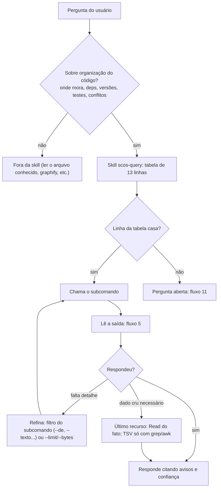
```mermaid
flowchart TD
    P[Pergunta do usuário] --> Q{Sobre organização do código?<br/>onde mora, deps, versões, testes, conflitos}
    Q -- não --> X["Fora da skill (ler o arquivo conhecido, graphify, etc.)"]
    Q -- sim --> S[Skill scos-query: tabela de 13 linhas]
    S --> M{Linha da tabela casa?}
    M -- sim --> C[Chama o subcomando]
    M -- "não" --> A[Pergunta aberta: fluxo 11]
    C --> OUT[Lê a saída: fluxo 5]
    OUT --> OK{Respondeu?}
    OK -- sim --> R[Responde citando avisos e confiança]
    OK -- "falta detalhe" --> RF["Refina: filtro do subcomando (--de, --texto...) ou --limit/--bytes"]
    RF --> C
    OK -- "dado cru necessário" --> L["Último recurso: Read do fato; TSV só com grep/awk"]
    L --> R
```

## 2. Qual subcomando chamar (tabela de roteamento)

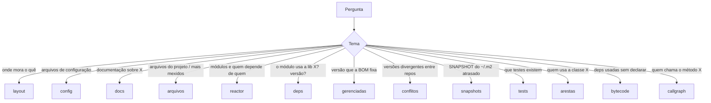
```mermaid
flowchart TD
    Q[Pergunta] --> A{Tema}
    A -->|"onde mora o quê"| layout
    A -->|"arquivos de configuração"| config
    A -->|"documentação sobre X"| docs
    A -->|"arquivos do projeto / mais mexidos"| arquivos
    A -->|"módulos e quem depende de quem"| reactor
    A -->|"o módulo usa a lib X? versão?"| deps
    A -->|"versão que a BOM fixa"| gerenciadas
    A -->|"versões divergentes entre repos"| conflitos
    A -->|"SNAPSHOT do ~/.m2 atrasado"| snapshots
    A -->|"que testes existem"| tests
    A -->|"quem usa a classe X"| arestas
    A -->|"deps usadas sem declarar"| bytecode
    A -->|"quem chama o método X"| callgraph
```

## 3. Escopo e argumentos de cada subcomando

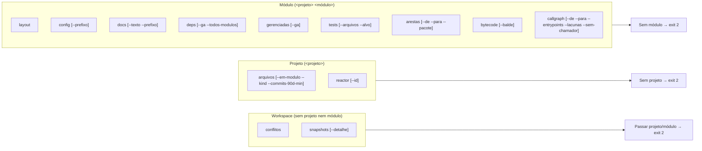
```mermaid
flowchart LR
    subgraph W["Workspace (sem projeto nem módulo)"]
        conflitos
        snapshots["snapshots [--detalhe]"]
    end
    subgraph PR["Projeto (&lt;projeto&gt;)"]
        arquivos["arquivos [--em-modulo --kind --commits-90d-min]"]
        reactor["reactor [--id]"]
    end
    subgraph MO["Módulo (&lt;projeto&gt; &lt;módulo&gt;)"]
        layout
        config["config [--prefixo]"]
        docs["docs [--texto --prefixo]"]
        deps["deps [--ga --todos-modulos]"]
        gerenciadas["gerenciadas [--ga]"]
        tests["tests [--arquivos --alvo]"]
        arestas["arestas [--de --para --pacote]"]
        bytecode["bytecode [--balde]"]
        callgraph["callgraph [--de --para --entrypoints --lacunas --sem-chamador]"]
    end
    W --> E1["Passar projeto/módulo → exit 2"]
    PR --> E2["Sem projeto → exit 2"]
    MO --> E3["Sem módulo → exit 2"]
```

Flags comuns a todos: `--limit N`, `--bytes N`, `--all` (não combina com os dois anteriores), `--base`.
`deps --todos-modulos` é a exceção que troca o escopo de módulo para projeto.

## 4. Ciclo de uma chamada (o que o CLI faz)

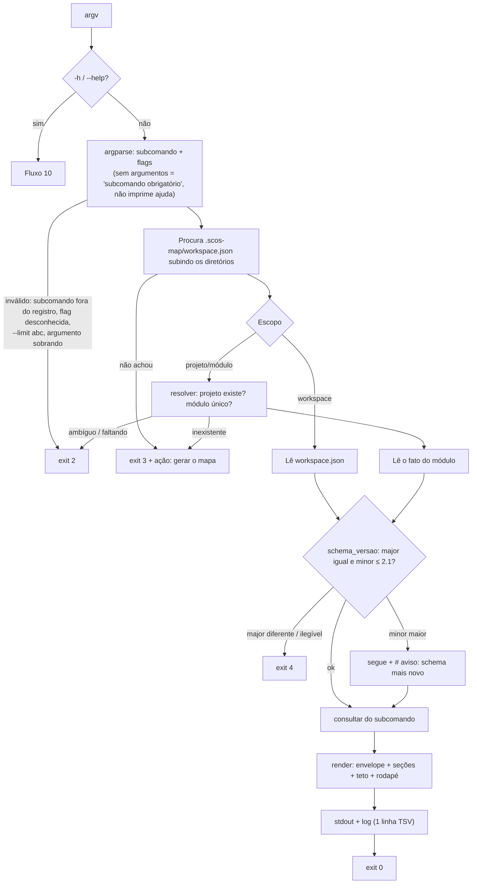
```mermaid
flowchart TD
    I[argv] --> H{"-h / --help?"}
    H -- sim --> HF[Fluxo 10]
    H -- não --> PA["argparse: subcomando + flags<br/>(sem argumentos = 'subcomando obrigatório', não imprime ajuda)"]
    PA -- "inválido: subcomando fora do registro, flag desconhecida,<br/>--limit abc, argumento sobrando" --> E2[exit 2]
    PA --> RZ[Procura .scos-map/workspace.json subindo os diretórios]
    RZ -- não achou --> E3[exit 3 + ação: gerar o mapa]
    RZ --> SC{Escopo}
    SC -- workspace --> WS[Lê workspace.json]
    SC -- "projeto/módulo" --> RES[resolver: projeto existe? módulo único?]
    RES -- "inexistente" --> E3
    RES -- "ambíguo / faltando" --> E2
    RES --> FT[Lê o fato do módulo]
    WS --> SQ
    FT --> SQ{"schema_versao: major igual e minor ≤ 2.1?"}
    SQ -- "major diferente / ilegível" --> E4[exit 4]
    SQ -- "minor maior" --> AV["segue + # aviso: schema mais novo"]
    SQ -- ok --> CMD[consultar do subcomando]
    AV --> CMD
    CMD --> RD["render: envelope + seções + teto + rodapé"]
    RD --> EM["stdout + log (1 linha TSV)"]
    EM --> X0[exit 0]
```

## 5. Como ler a saída

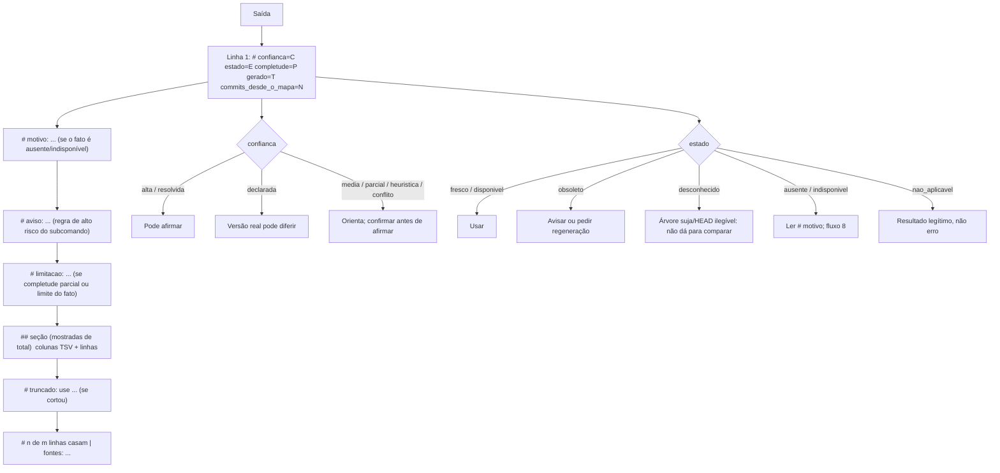
```mermaid
flowchart TD
    O[Saída] --> H1["Linha 1: # confianca=C estado=E completude=P gerado=T commits_desde_o_mapa=N"]
    H1 --> M["# motivo: ... (se o fato é ausente/indisponível)"]
    M --> AVI["# aviso: ... (regra de alto risco do subcomando)"]
    AVI --> LIM["# limitacao: ... (se completude parcial ou limite do fato)"]
    LIM --> SEC["## seção (mostradas de total)  colunas TSV + linhas"]
    SEC --> TR["# truncado: use ... (se cortou)"]
    TR --> RO["# n de m linhas casam | fontes: ..."]
    H1 --> CF{confianca}
    CF -->|"alta / resolvida"| A1[Pode afirmar]
    CF -->|"declarada"| A2[Versão real pode diferir]
    CF -->|"media / parcial / heuristica / conflito"| A3[Orienta; confirmar antes de afirmar]
    H1 --> ES{estado}
    ES -->|"fresco / disponivel"| B1[Usar]
    ES -->|obsoleto| B2["Avisar ou pedir regeneração"]
    ES -->|desconhecido| B3["Árvore suja/HEAD ilegível: não dá para comparar"]
    ES -->|"ausente / indisponivel"| B4["Ler # motivo; fluxo 8"]
    ES -->|nao_aplicavel| B5["Resultado legítimo, não erro"]
```

## 6. Truncamento e flags de tamanho

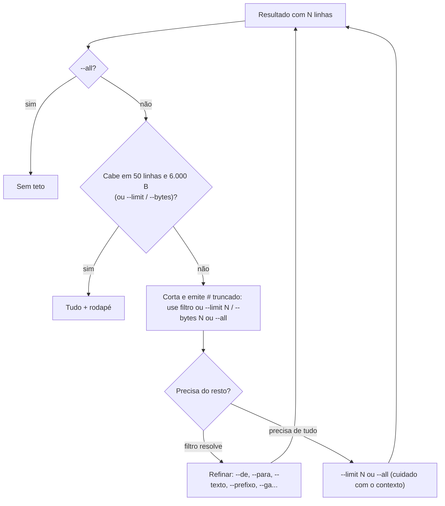
```mermaid
flowchart TD
    R[Resultado com N linhas] --> T{"--all?"}
    T -- sim --> ALL[Sem teto]
    T -- não --> CAP{"Cabe em 50 linhas e 6.000 B<br/>(ou --limit / --bytes)?"}
    CAP -- sim --> FULL[Tudo + rodapé]
    CAP -- não --> CUT["Corta e emite # truncado: use filtro ou --limit N / --bytes N ou --all"]
    CUT --> D{Precisa do resto?}
    D -- "filtro resolve" --> F["Refinar: --de, --para, --texto, --prefixo, --ga..."]
    D -- "precisa de tudo" --> W["--limit N ou --all (cuidado com o contexto)"]
    F --> R
    W --> R
```

## 7. Erros e exit codes

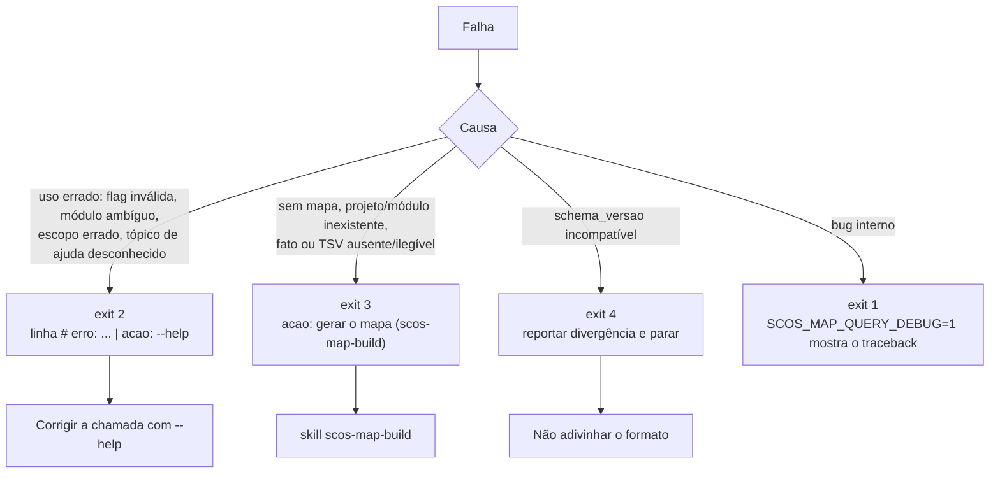
```mermaid
flowchart TD
    E[Falha] --> C{Causa}
    C -->|"uso errado: flag inválida, módulo ambíguo,<br/>escopo errado, tópico de ajuda desconhecido"| X2["exit 2<br/>linha # erro: ... | acao: --help"]
    C -->|"sem mapa, projeto/módulo inexistente,<br/>fato ou TSV ausente/ilegível"| X3["exit 3<br/>acao: gerar o mapa (scos-map-build)"]
    C -->|"schema_versao incompatível"| X4["exit 4<br/>reportar divergência e parar"]
    C -->|"bug interno"| X1["exit 1<br/>SCOS_MAP_QUERY_DEBUG=1 mostra o traceback"]
    X3 --> B[skill scos-map-build]
    X2 --> H["Corrigir a chamada com --help"]
    X4 --> STOP["Não adivinhar o formato"]
```

Fato `indisponivel` / `nao_aplicavel` **não** é erro: exit 0 com `# motivo:` (fluxo 8).
Exit 1 só mostra `# erro: interno`; o traceback exige `SCOS_MAP_QUERY_DEBUG=1`. Catálogo completo: seção 22.

## 8. Fatos de Tier 2/3 (arestas, bytecode, callgraph, tests)

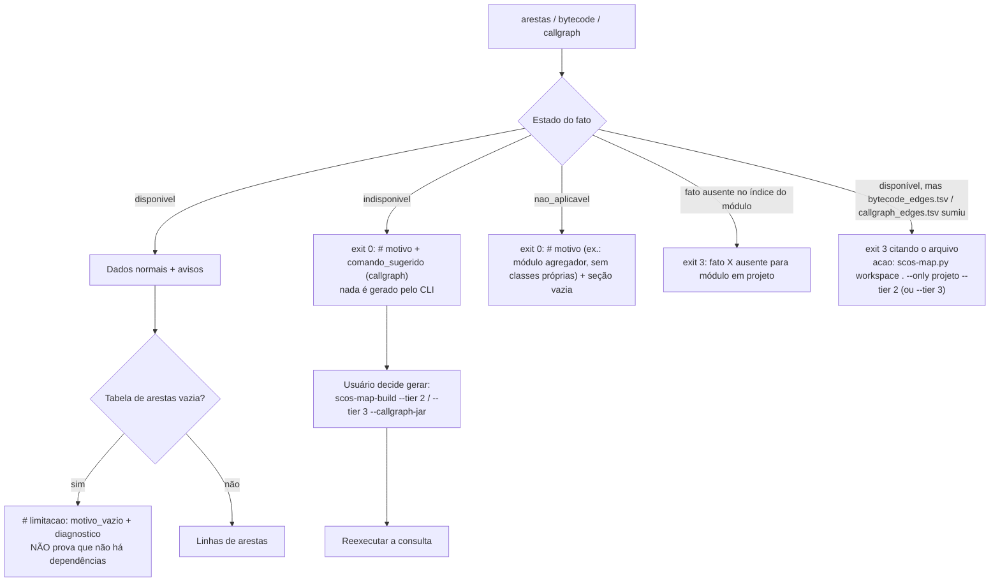
```mermaid
flowchart TD
    A["arestas / bytecode / callgraph"] --> F{Estado do fato}
    F -->|disponivel| D["Dados normais + avisos"]
    F -->|indisponivel| I["exit 0: # motivo + comando_sugerido (callgraph)<br/>nada é gerado pelo CLI"]
    F -->|nao_aplicavel| N["exit 0: # motivo (ex.: módulo agregador, sem classes próprias) + seção vazia"]
    F -->|"fato ausente no índice do módulo"| X3["exit 3: fato X ausente para módulo em projeto"]
    F -->|"disponível, mas bytecode_edges.tsv / callgraph_edges.tsv sumiu"| X3T["exit 3 citando o arquivo<br/>acao: scos-map.py workspace . --only projeto --tier 2 (ou --tier 3)"]
    D --> V{Tabela de arestas vazia?}
    V -- sim --> VZ["# limitacao: motivo_vazio + diagnostico<br/>NÃO prova que não há dependências"]
    V -- não --> OKD[Linhas de arestas]
    I --> G["Usuário decide gerar:<br/>scos-map-build --tier 2 / --tier 3 --callgraph-jar"]
    G --> RE[Reexecutar a consulta]
```

## 9. Fluxos por subcomando

### 9.1 Estrutura: `layout`, `config`, `docs`, `arquivos`, `reactor`

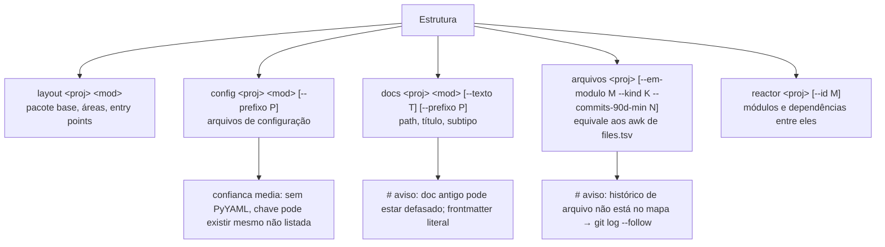
```mermaid
flowchart TD
    S[Estrutura] --> L["layout &lt;proj&gt; &lt;mod&gt;<br/>pacote base, áreas, entry points"]
    S --> CF["config &lt;proj&gt; &lt;mod&gt; [--prefixo P]<br/>arquivos de configuração"]
    S --> DC["docs &lt;proj&gt; &lt;mod&gt; [--texto T] [--prefixo P]<br/>path, título, subtipo"]
    S --> AR["arquivos &lt;proj&gt; [--em-modulo M --kind K --commits-90d-min N]<br/>equivale aos awk de files.tsv"]
    S --> RC["reactor &lt;proj&gt; [--id M]<br/>módulos e dependências entre eles"]
    DC --> DA["# aviso: doc antigo pode estar defasado; frontmatter literal"]
    AR --> AA["# aviso: histórico de arquivo não está no mapa → git log --follow"]
    CF --> CM["confianca media: sem PyYAML, chave pode existir mesmo não listada"]
```

### 9.2 Dependências: `deps`, `gerenciadas`

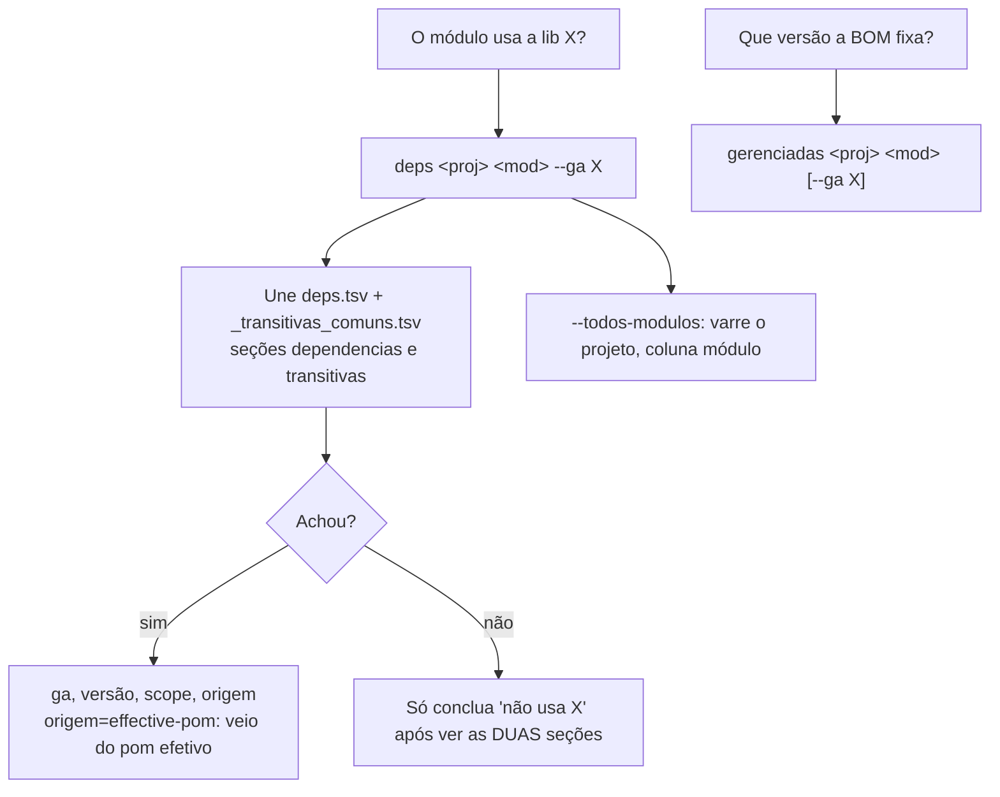
```mermaid
flowchart TD
    Q["O módulo usa a lib X?"] --> D["deps &lt;proj&gt; &lt;mod&gt; --ga X"]
    D --> U["Une deps.tsv + _transitivas_comuns.tsv<br/>seções dependencias e transitivas"]
    U --> R{Achou?}
    R -- sim --> V["ga, versão, scope, origem<br/>origem=effective-pom: veio do pom efetivo"]
    R -- "não" --> NO["Só conclua 'não usa X' após ver as DUAS seções"]
    D --> TM["--todos-modulos: varre o projeto, coluna módulo"]
    Q2["Que versão a BOM fixa?"] --> G["gerenciadas &lt;proj&gt; &lt;mod&gt; [--ga X]"]
```

### 9.3 Cruzado: `conflitos`, `snapshots`

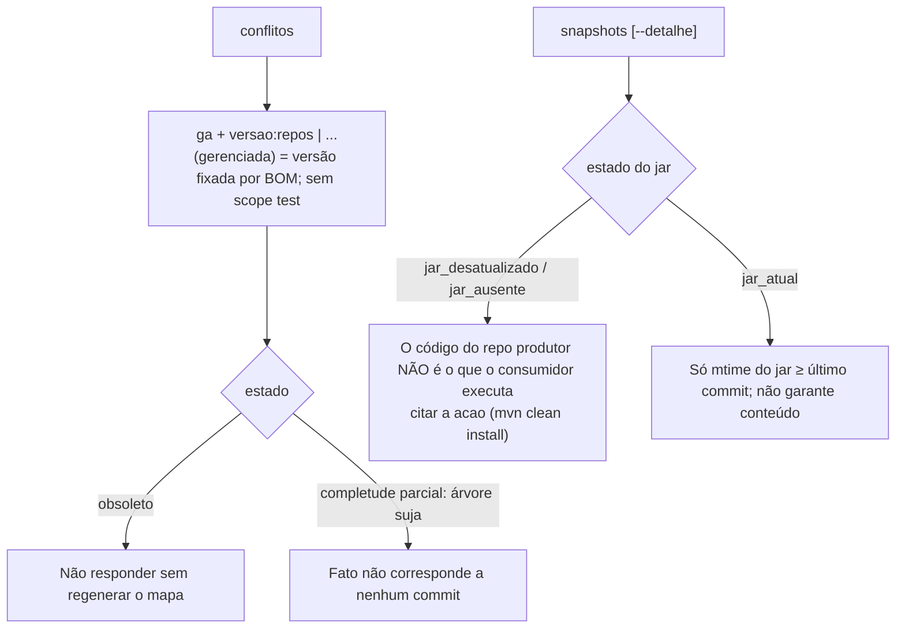
```mermaid
flowchart TD
    C["conflitos"] --> CR["ga + versao:repos | ...<br/>(gerenciada) = versão fixada por BOM; sem scope test"]
    CR --> CE{"estado"}
    CE -->|obsoleto| CO["Não responder sem regenerar o mapa"]
    CE -->|"completude parcial: árvore suja"| CP["Fato não corresponde a nenhum commit"]
    S["snapshots [--detalhe]"] --> SS{"estado do jar"}
    SS -->|jar_desatualizado / jar_ausente| SD["O código do repo produtor NÃO é o que o consumidor executa<br/>citar a acao (mvn clean install)"]
    SS -->|jar_atual| SA["Só mtime do jar ≥ último commit; não garante conteúdo"]
```

### 9.4 Qualidade: `tests`, `bytecode`, `arestas`, `callgraph`

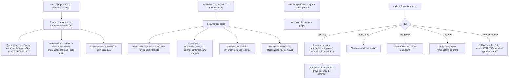
```mermaid
flowchart TD
    T["tests &lt;proj&gt; &lt;mod&gt; [--arquivos] [--alvo X]"] --> T1["Resumo: raízes, tipos, frameworks, cobertura"]
    T1 --> T2["[heuristica]: dizer 'existe um teste chamado XTest', nunca 'X está testada'"]
    T1 --> T3["Zero achados = nenhum arquivo nas raízes analisadas, não 'não existe teste'"]
    T1 --> T4["cobertura nao_analisado ≠ sem cobertura"]
    B["bytecode &lt;proj&gt; &lt;mod&gt; [--balde NOME]"] --> B1["Resumo por balde"]
    B1 --> B2["deps_usadas_ausentes_do_pom: único risco imediato"]
    B1 --> B3["via_transitiva / declaradas_sem_uso: higiene, confirmar com humano"]
    B1 --> B4["ignoradas_na_analise: informativo, nunca reportar"]
    B1 --> B5["transitivas_resolvidas falso: divisão não confiável"]
    AR["arestas &lt;proj&gt; &lt;mod&gt; [--de --para --pacote]"] --> AR1["de, para, tipo, origem (jdeps)"]
    CG["callgraph &lt;proj&gt; &lt;mod&gt;"] --> CG0{Flag}
    CG0 -->|"sem flag"| CG1["Resumo: arestas, ambíguas, entrypoints, lacunas, sem_chamador"]
    CG0 -->|"--de / --para"| CG2["Classe#metodo ou prefixo"]
    CG0 -->|"--entrypoints"| CG3["Arestas das classes de entrypoint"]
    CG0 -->|"--lacunas"| CG4["Proxy, Spring Data, reflexão fora do grafo"]
    CG0 -->|"--sem-chamador"| CG5["NÃO é lista de código morto: HTTP, @Scheduled, @EventListener"]
    CG1 --> CGA["Ausência de aresta não prova ausência de chamada"]
```

## 10. Fluxos de `--help`

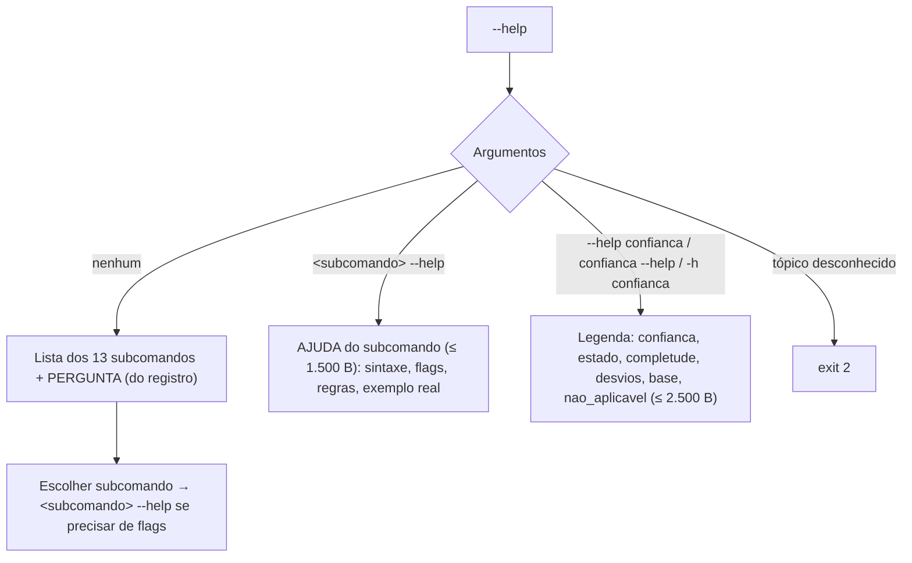
```mermaid
flowchart TD
    H["--help"] --> A{Argumentos}
    A -->|"nenhum"| G["Lista dos 13 subcomandos + PERGUNTA (do registro)"]
    A -->|"&lt;subcomando&gt; --help"| SH["AJUDA do subcomando (≤ 1.500 B): sintaxe, flags, regras, exemplo real"]
    A -->|"--help confianca / confianca --help / -h confianca"| CH["Legenda: confianca, estado, completude, desvios, base, nao_aplicavel (≤ 2.500 B)"]
    A -->|"tópico desconhecido"| ER["exit 2"]
    G --> NX["Escolher subcomando → &lt;subcomando&gt; --help se precisar de flags"]
```

## 11. Pergunta aberta ("explique este repo")

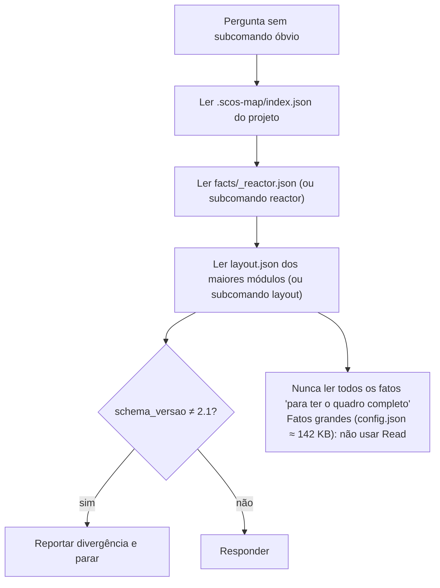
```mermaid
flowchart TD
    Q["Pergunta sem subcomando óbvio"] --> R1["Ler .scos-map/index.json do projeto"]
    R1 --> R2["Ler facts/_reactor.json (ou subcomando reactor)"]
    R2 --> R3["Ler layout.json dos maiores módulos (ou subcomando layout)"]
    R3 --> CHK{"schema_versao ≠ 2.1?"}
    CHK -- sim --> STOP["Reportar divergência e parar"]
    CHK -- não --> ANS[Responder]
    R3 --> NO["Nunca ler todos os fatos 'para ter o quadro completo'<br/>Fatos grandes (config.json ≈ 142 KB): não usar Read"]
```

## 12. Mapa ausente, obsoleto ou desatualizado

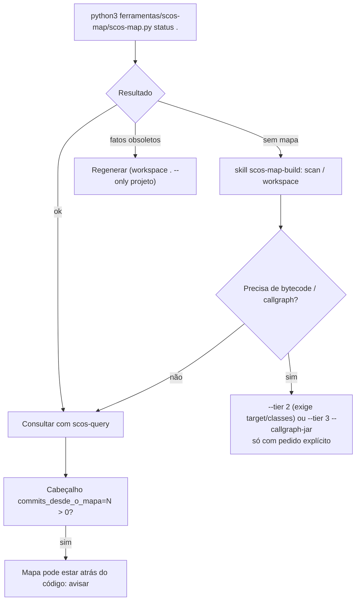
```mermaid
flowchart TD
    S["python3 ferramentas/scos-map/scos-map.py status ."] --> E{Resultado}
    E -->|"sem mapa"| B["skill scos-map-build: scan / workspace"]
    E -->|"fatos obsoletos"| B2["Regenerar (workspace . --only projeto)"]
    E -->|"ok"| Q["Consultar com scos-query"]
    Q --> H["Cabeçalho commits_desde_o_mapa=N > 0?"]
    H -- sim --> W["Mapa pode estar atrás do código: avisar"]
    B --> T{Precisa de bytecode / callgraph?}
    T -- sim --> T2["--tier 2 (exige target/classes) ou --tier 3 --callgraph-jar<br/>só com pedido explícito"]
    T -- não --> Q
```

## 13. Qual skill usar

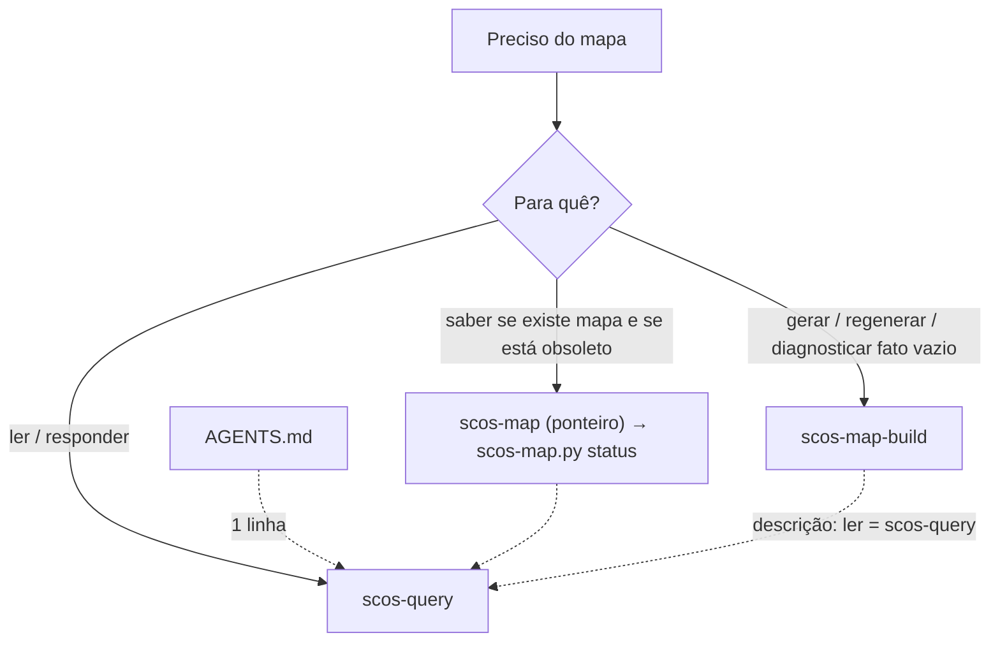
```mermaid
flowchart TD
    Q[Preciso do mapa] --> A{Para quê?}
    A -->|"ler / responder"| QS[scos-query]
    A -->|"gerar / regenerar / diagnosticar fato vazio"| SB[scos-map-build]
    A -->|"saber se existe mapa e se está obsoleto"| SM["scos-map (ponteiro) → scos-map.py status"]
    AG["AGENTS.md"] -.->|"1 linha"| QS
    SM -.-> QS
    SB -.->|"descrição: ler = scos-query"| QS
```

## 14. Log por chamada e métricas de adoção

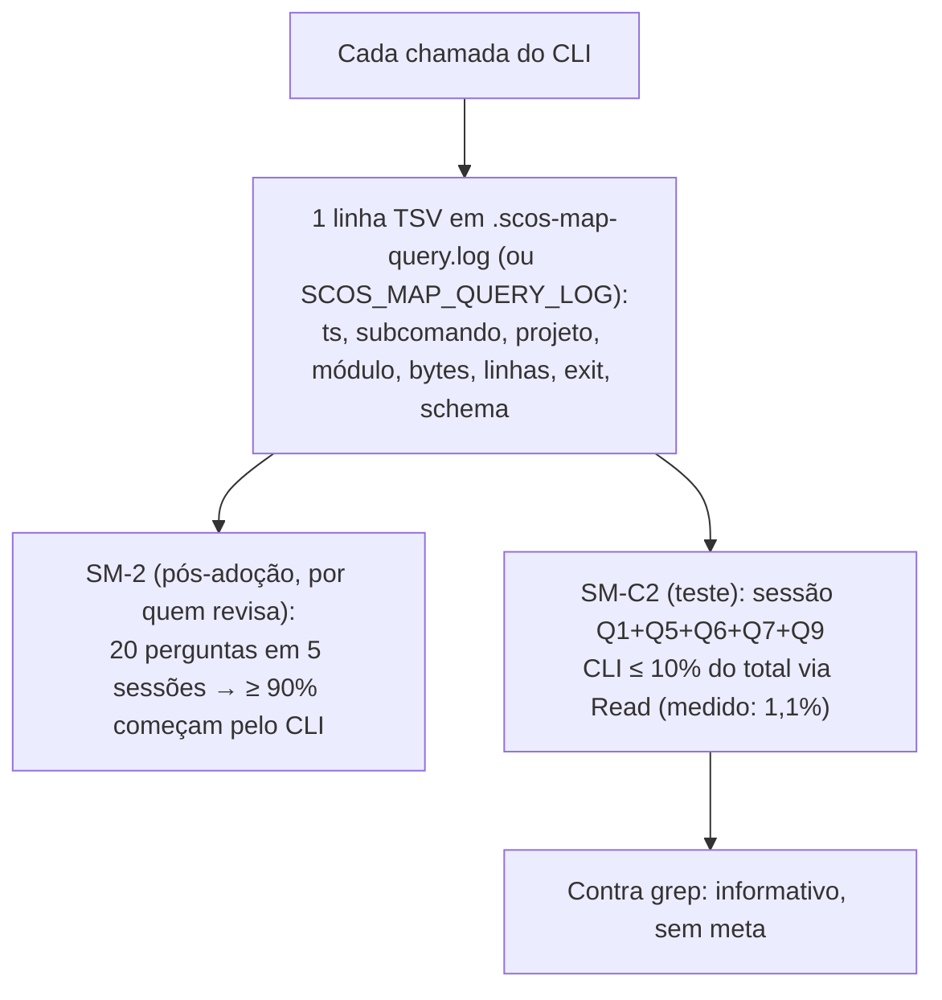
```mermaid
flowchart TD
    CH[Cada chamada do CLI] --> LG["1 linha TSV em .scos-map-query.log (ou SCOS_MAP_QUERY_LOG):<br/>ts, subcomando, projeto, módulo, bytes, linhas, exit, schema"]
    LG --> SM2["SM-2 (pós-adoção, por quem revisa):<br/>20 perguntas em 5 sessões → ≥ 90% começam pelo CLI"]
    LG --> SMC["SM-C2 (teste): sessão Q1+Q5+Q6+Q7+Q9<br/>CLI ≤ 10% do total via Read (medido: 1,1%)"]
    SMC --> GR["Contra grep: informativo, sem meta"]
```

## 15. Como o Epic 4 chegou aqui

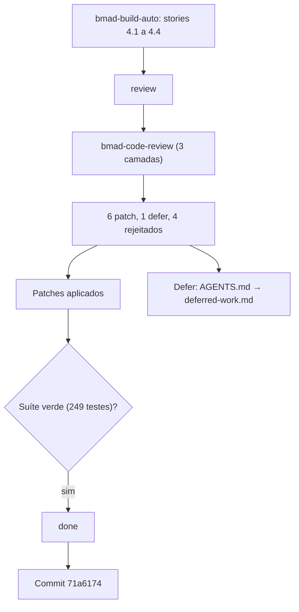
```mermaid
flowchart TD
    B["bmad-build-auto: stories 4.1 a 4.4"] --> R["review"]
    R --> CR["bmad-code-review (3 camadas)"]
    CR --> TR["6 patch, 1 defer, 4 rejeitados"]
    TR --> PA["Patches aplicados"]
    PA --> T{"Suíte verde (249 testes)?"}
    T -- sim --> DN["done"]
    DN --> CM["Commit 71a6174"]
    TR --> DF["Defer: AGENTS.md → deferred-work.md"]
```

## 16. Sessão típica, do começo ao fim

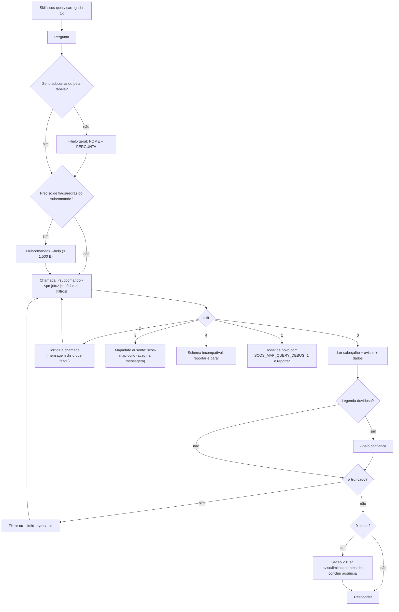
```mermaid
flowchart TD
    A["Skill scos-query carregada 1x"] --> B["Pergunta"]
    B --> C{"Sei o subcomando pela tabela?"}
    C -- não --> D["--help geral: NOME + PERGUNTA"]
    D --> E
    C -- sim --> E{"Preciso de flags/regras do subcomando?"}
    E -- sim --> F["&lt;subcomando&gt; --help (≤ 1.500 B)"]
    E -- não --> G
    F --> G["Chamada: &lt;subcomando&gt; &lt;projeto&gt; [&lt;módulo&gt;] [filtros]"]
    G --> H{"exit"}
    H -- 0 --> I["Ler cabeçalho + avisos + dados"]
    H -- 2 --> J["Corrigir a chamada (mensagem diz o que faltou)"] --> G
    H -- 3 --> K["Mapa/fato ausente: scos-map-build (acao na mensagem)"]
    H -- 4 --> L["Schema incompatível: reportar e parar"]
    H -- 1 --> M["Rodar de novo com SCOS_MAP_QUERY_DEBUG=1 e reportar"]
    I --> N{"Legenda duvidosa?"}
    N -- sim --> O["--help confianca"] --> P
    N -- não --> P{"# truncado?"}
    P -- sim --> Q["Filtrar ou --limit/--bytes/--all"] --> G
    P -- não --> R{"0 linhas?"}
    R -- sim --> S["Seção 20: ler aviso/limitacao antes de concluir ausência"]
    R -- não --> T["Responder"]
    S --> T
```

## 17. Resolução de projeto e módulo

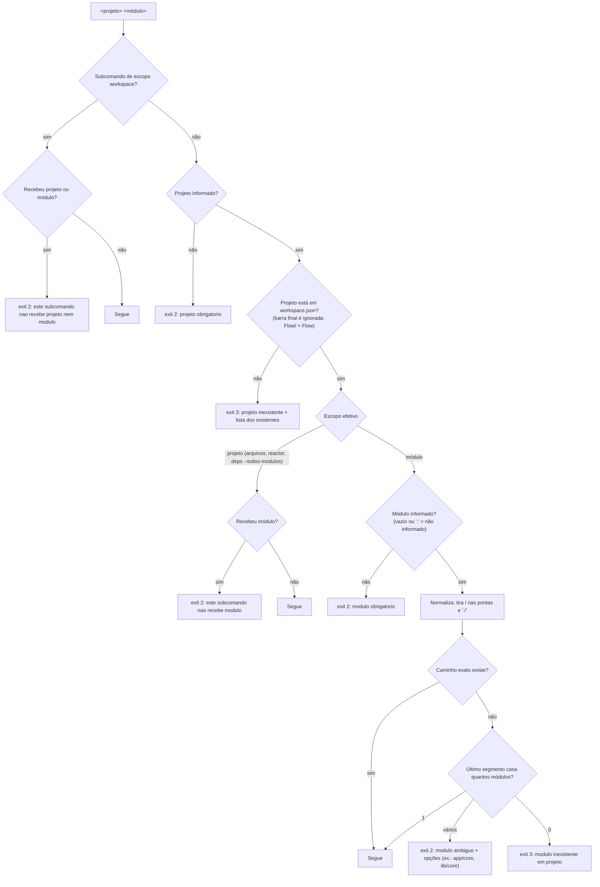
```mermaid
flowchart TD
    A["&lt;projeto&gt; &lt;módulo&gt;"] --> B{"Subcomando de escopo workspace?"}
    B -- sim --> B1{"Recebeu projeto ou módulo?"}
    B1 -- sim --> E2a["exit 2: este subcomando nao recebe projeto nem modulo"]
    B1 -- não --> OKW[Segue]
    B -- não --> C{"Projeto informado?"}
    C -- não --> E2b["exit 2: projeto obrigatorio"]
    C -- sim --> D{"Projeto está em workspace.json?<br/>(barra final é ignorada: Flow/ = Flow)"}
    D -- não --> E3a["exit 3: projeto inexistente + lista dos existentes"]
    D -- sim --> F{"Escopo efetivo"}
    F -->|"projeto (arquivos, reactor, deps --todos-modulos)"| G{"Recebeu módulo?"}
    G -- sim --> E2c["exit 2: este subcomando nao recebe modulo"]
    G -- não --> OKP[Segue]
    F -->|"módulo"| H{"Módulo informado?<br/>(vazio ou '.' = não informado)"}
    H -- não --> E2d["exit 2: modulo obrigatorio"]
    H -- sim --> I["Normaliza: tira / nas pontas e './'"]
    I --> J{"Caminho exato existe?"}
    J -- sim --> OKM[Segue]
    J -- não --> K{"Último segmento casa quantos módulos?"}
    K -- 1 --> OKM
    K -- "vários" --> E2e["exit 2: modulo ambiguo + opções (ex.: app/core, lib/core)"]
    K -- 0 --> E3b["exit 3: modulo inexistente em projeto"]
```

Exemplos conferidos: `organization`, `./organization` e `flow-organization-usecase` (nome curto) resolvem; `core` com
`app/core` e `lib/core` dá ambíguo; `layout` em módulo agregador devolve seções vazias (exit 0), não erro.

## 18. Flags comuns e validações

```mermaid
flowchart TD
    F["Flags comuns"] --> L["--limit N / --bytes N"]
    F --> AL["--all"]
    F --> BA["--base"]
    L --> V1{"N inteiro ≥ 1?"}
    V1 -- não --> E2a["exit 2: deve ser >= 1 / invalid value"]
    V1 -- sim --> TT["Teto troca: 50 linhas / 6.000 B → N"]
    AL --> V2{"Junto de --limit ou --bytes?"}
    V2 -- sim --> E2b["exit 2: --all nao combina com --limit/--bytes"]
    V2 -- não --> SEM["Sem teto (cuidado com o contexto)"]
    BA --> B1["Acrescenta '# base: ...' (origem literal do dado) após o cabeçalho"]
    B1 --> B2["Vários fatos: uma linha # base: por base distinta"]
    X["Flag de outro subcomando<br/>(ex.: --todos-modulos em layout)"] --> E2c["exit 2: unrecognized arguments"]
    Y["Valor inválido de filtro<br/>(--balde xyz, --commits-90d-min abc)"] --> E2d["exit 2 (--balde lista os válidos)"]
    Z["Linha &gt; 240 caracteres"] --> TL["Cortada com …; a coluna marca nunca é cortada"]
```

## 19. Como o `estado` do cabeçalho é calculado

```mermaid
flowchart TD
    A["Fato lido"] --> B{"Estado gravado no índice/fato"}
    B -->|"ausente / indisponivel / nao_aplicavel / obsoleto"| R1["Esse estado é propagado"]
    B -->|"outro"| C{"Escopo"}
    C -->|"projeto/módulo"| D{"HEAD do mapa e HEAD atual (.git/HEAD) legíveis?"}
    D -- não --> DESC1["desconhecido (ex.: repo sem .git)"]
    D -- sim --> E{"HEAD atual começa com o do mapa?"}
    E -- sim --> FR["fresco / disponivel"]
    E -- não --> OB1["obsoleto"]
    C -->|"workspace (conflitos, snapshots)"| W["Para cada repo em derivado_de"]
    W --> W1{"head ou .git/HEAD ilegível, ou sem derivado_de?"}
    W1 -- sim --> DESC2["desconhecido"]
    W1 -- não --> W2{"HEAD mudou?"}
    W2 -- sim --> OB2["obsoleto"]
    W2 -- não --> W3{"Projeto com árvore suja no mapa?"}
    W3 -- sim --> DESC3["desconhecido (+ limitação 'arvore suja')"]
    W3 -- não --> FR2["fresco"]
    W --> PIOR["Resultado = pior caso: obsoleto &gt; desconhecido &gt; fresco"]
    FR --> CM["commits_desde_o_mapa=N (git rev-list --count; omitido sem git)"]
    OB1 --> CM
```

Observação conferida no mapa real: os fatos do Flow aparecem `estado=obsoleto` com `commits_desde_o_mapa=1`
(o repo andou depois do mapa); a skill manda avisar ou regenerar, não esconder.

## 20. Resultado vazio não é erro

```mermaid
flowchart TD
    A["Chamada válida, 0 linhas"] --> B{"Causa provável"}
    B -->|"filtro sem match<br/>(--ga nada, --kind nada, --texto zzz, reactor --id zzz)"| C["exit 0: '## seção (0 de 0)' + rodapé '0 de 0 linhas casam'"]
    B -->|"estado nao_aplicavel"| D["exit 0 + # motivo (módulo agregador, sem código)"]
    B -->|"estado indisponivel"| E["exit 0 + # motivo; callgraph traz comando_sugerido no resumo"]
    B -->|"arestas vazias com fato disponível"| F["# limitacao: motivo_vazio + diagnostico<br/>não prova ausência de dependência"]
    B -->|"tests: zero arquivos"| G["Nenhum teste nas raízes analisadas ≠ 'não existe teste'"]
    B -->|"balde não calculado"| H["# limitacao: nao calculado (0 itens ≠ balde vazio)"]
    C --> Z["Antes de afirmar ausência: conferir # aviso / # limitacao / # motivo"]
    D --> Z
    E --> Z
    F --> Z
    G --> Z
    H --> Z
```

## 21. Ambiente: diretório, git, log, pipe e depuração

```mermaid
flowchart TD
    A["Execução"] --> B{"Onde está o cwd?"}
    B -->|"raiz, ou subpasta de qualquer repo do workspace"| C["Sobe os ancestrais até achar .scos-map/workspace.json"]
    B -->|"fora do workspace"| E3["exit 3: workspace.json nao encontrado em nenhum ancestral"]
    C --> D{"git disponível no PATH?"}
    D -- sim --> D1["commits_desde_o_mapa=N no cabeçalho"]
    D -- não --> D2["Sem commits_desde_o_mapa; estado ainda vem de .git/HEAD"]
    A --> L{"Gravar log"}
    L -->|"ok"| L1[".scos-map-query.log na raiz (ou SCOS_MAP_QUERY_LOG)"]
    L -->|"falha (caminho inválido)"| L2["Ignorada: a resposta sai normalmente"]
    L -->|"sem workspace (cwd fora)"| L3["Sem log"]
    A --> P{"Leitor fechou o pipe (| head -1)?"}
    P -- sim --> P1["Termina sem erro (exit 0) e o log ainda é gravado"]
    A --> I{"Exceção não prevista?"}
    I -- sim --> I1["exit 1: '# erro: interno | acao: -'"]
    I1 --> I2["SCOS_MAP_QUERY_DEBUG=1 acrescenta o traceback"]
    A --> O["O CLI nunca escreve em .scos-map/, nunca compila e nunca chama o gerador"]
```

## 22. Catálogo de erros e saídas (conferido executando o CLI)

| Situação | exit | Mensagem / comportamento observado |
|---|---|---|
| Sem argumentos | 2 | `the following arguments are required: subcomando` |
| Subcomando inexistente | 2 | `invalid choice: 'xyz' (choose from ...)` |
| Flag desconhecida / argumento sobrando | 2 | `unrecognized arguments: ...` |
| `--limit abc`, `--bytes 0`, `--commits-90d-min abc` | 2 | `invalid ... value` / `deve ser >= 1` |
| `--all` com `--limit`/`--bytes` | 2 | `--all nao combina com --limit/--bytes` |
| `--help xyz`, `--help confianca extra`, `proj app --help` | 2 | `topico de ajuda desconhecido: ...` |
| `<subcomando> ... --help` (subcomando como 1º argumento) | 0 | `AJUDA` do subcomando |
| Projeto ausente / módulo ausente | 2 | `projeto obrigatorio` / `modulo obrigatorio` |
| Módulo passado a escopo projeto ou workspace | 2 | `este subcomando nao recebe modulo` / `... projeto nem modulo` |
| Módulo ambíguo | 2 | `modulo ambiguo: core (opcoes: app/core, lib/core)` |
| `--balde` inválido | 2 | `balde invalido: xyz; validos: ...` |
| Projeto inexistente | 3 | `projeto inexistente: x (existentes: ...)` |
| Módulo inexistente | 3 | `modulo inexistente em <projeto>: x` |
| Fora do workspace / `workspace.json` ausente | 3 | `workspace.json nao encontrado em nenhum ancestral` |
| `workspace.json` ilegível | 3 | `workspace.json ilegivel` |
| Fato ausente do índice do módulo | 3 | `fato config ausente para lib/core em proj` ou `<arquivo>.json ausente` |
| Fato ilegível / formato inesperado | 3 | `<arquivo> ilegivel` / `com formato inesperado` |
| TSV do fato ausente | 3 | `<arquivo>.tsv ausente` (cabeçalho do fato ainda sai) |
| Tabela de arestas ausente (bytecode/callgraph) | 3 | acao: `scos-map.py workspace . --only <proj> --tier 2 (ou --tier 3)` |
| Fato do workspace ausente | 3 | `fato conflitos_de_versao_cruzados ausente em workspace.json` |
| `schema_versao` major diferente, ausente ou ilegível | 4 | `incompativel com o testado 2.1` / `ausente ou ilegivel` |
| `schema_versao` minor maior (ex.: 2.9) | 0 | segue com `# aviso: schema 2.9 mais novo que o testado (2.1)` |
| Exceção interna | 1 | `# erro: interno` (traceback só com `SCOS_MAP_QUERY_DEBUG=1`) |
| `nao_aplicavel` / `indisponivel` | 0 | `# motivo:` + seções vazias ou resumo |
| Filtro sem match | 0 | `(0 de 0)` + rodapé |

Todas as mensagens de erro de uso trazem `acao: python3 ferramentas/scos-map/scos-map-query.py --help`;
as de mapa/fato ausente trazem `acao: python3 ferramentas/scos-map/scos-map.py workspace .`.
